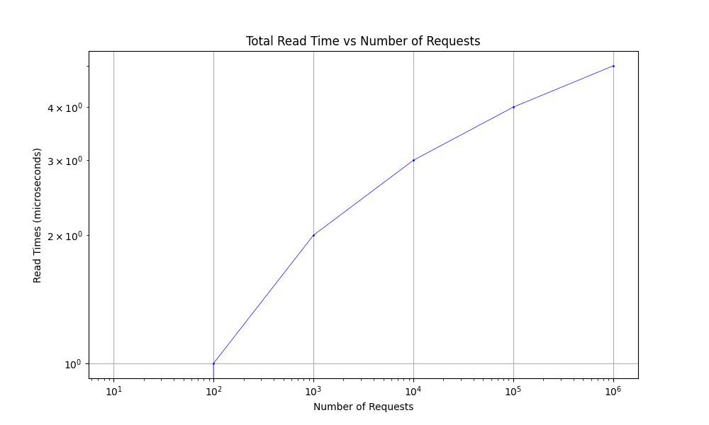

# distributed-database-system

This project creates a server protocol and basic server that stores a simple key-value database implemented in C. It also includes a client library and a basic client that can connect to the server.

The key-value library has benchmarks for read and write times (currently broken). The server also is benchmarked for reads. The benchmarking analysis is implemented in python.

## Directory Structure

```plaintext
distributed-database-system/
├── benchmark/
│   ├── benchmark.c
│   ├── graph-read-benchmarks.py
│   ├── Makefile
|   └── README.md
├── lib/
│   └── kvstore/
│       ├── benchmark/
│       |   ├── benchmark.c
│       |   └── graph-benchmark-data.py
│       ├── src/
│       |   ├── kvstore.c
│       |   └── kvstore.h
│       ├── Makefile
│       └── README.md
├── src/
│   ├── client/
│   |   ├── client_lib.c
│   |   ├── client_lib.h
│   |   ├── client.c
│   |   └── Makefile
│   └── server/
│       ├── Makefile
│       ├── protocol.c
│       ├── protocol.h
│       └── server.c
├── Makefile
└── README.md
```

## Getting Started

### Prerequisites
- GCC (GNU Compiler Collection)
- Make utility

### Building the Project
1. Navigate to the root directory
2. Run the following command: `make`

### Cleaning the Project
To remove all executables:
1. Navigate to the root directory
2. Run the following command: `make clean`

## Running the Benchmarks

### Prerequisites
- Python 3 with pip
- matplotlib: `pip install matplotlib`

After building the project:
1. Navigate to the root directory
2. Run the executable: `./bin/benchmark`
3. Run `python benchmark/graph-read-benchmarks.py`

### Benchmark Results

