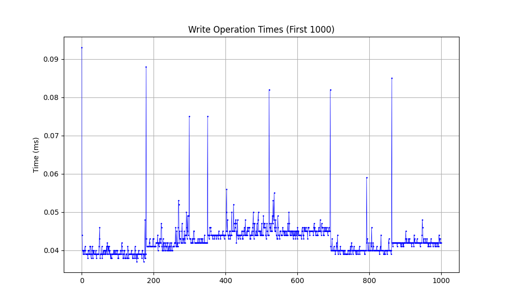
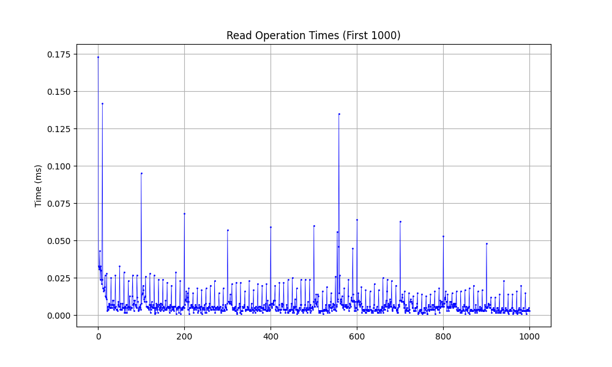

# KVStore Benchmark Analysis

## Benchmark Results

### Graphing the Benchmarks

### Prerequisites
- Python 3 with pip
- matplotlib: `pip install matplotlib`

After [running the benchmarks](../README.md#running-the-benchmarks):
1. Navigate to the root directory
2. Run `python analysis/graph-benchmark-data.py`