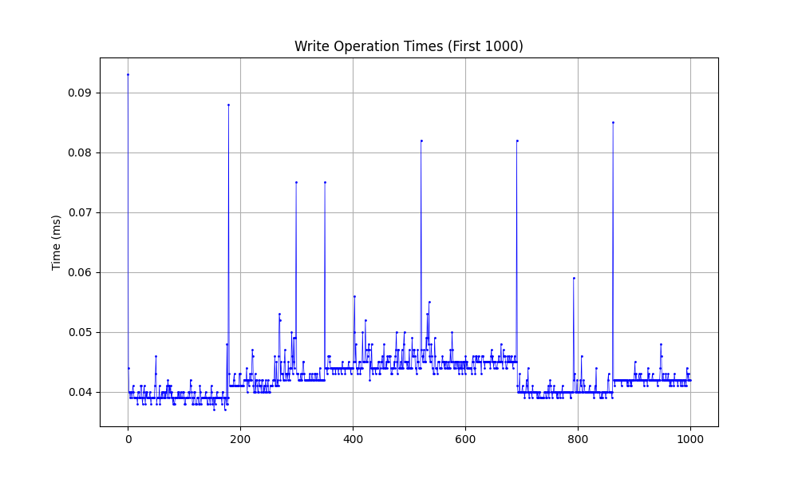
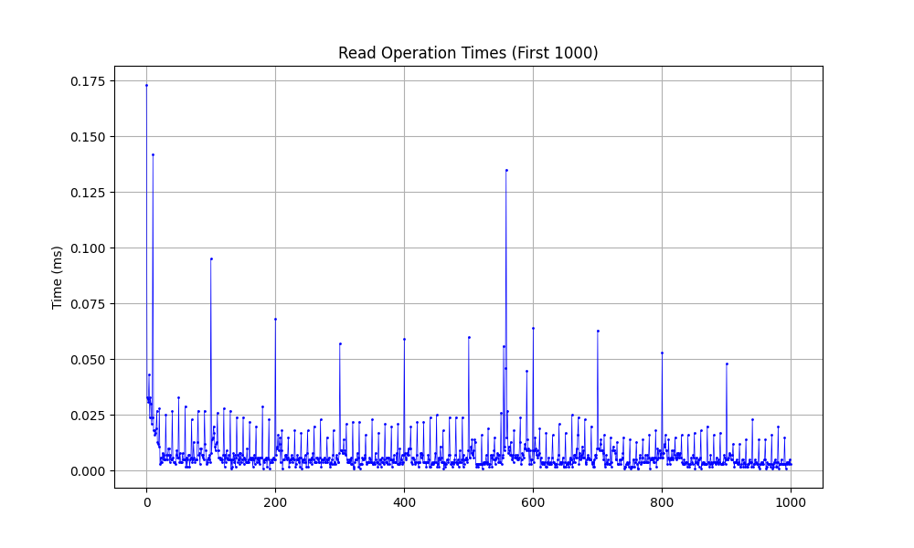

# KVStore

## Running the Benchmarks (currently broken)

### Prerequisites
- Python 3 with pip
- matplotlib: `pip install matplotlib`

1. Navigate to the kvstore directory: `lib/kvstore`
2. Run the executable: `./bin/benchmark`
3. Run `python benchmark/graph-benchmark-data.py`

### Benchmark Results

